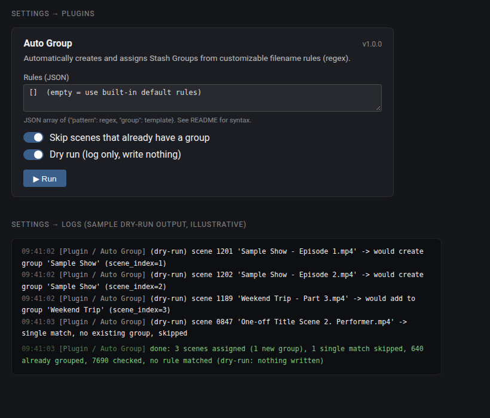

# Auto Group for Stash

A [Stash](https://github.com/stashapp/stash) plugin that automatically creates and assigns
**Groups** from customizable filename rules (regex) — for series/episodes/multi-part scenes
that were never grouped, without doing it by hand.



*Illustrative mockup with placeholder data — not a screenshot of a real library.*

## How it decides

- Each scene's **file basename** (not the full path) is checked against a list of rules: a
  regex `pattern` and a `group` name template. First matching rule wins.
- A capture group named `index` (e.g. `(?P<index>\d+)`) becomes the scene's position inside
  the group (`scene_index`) if present and numeric.
- **A new Group is only created when at least 2 scenes match the same name in the same run.**
  A single match only joins a Group that *already exists* with that exact name (e.g. one more
  episode of a series you already grouped); it's otherwise skipped. This keeps the tool from
  creating one-scene "groups" out of unrelated titles that just happen to contain a number.
- **Similar names join the existing group.** A group name taken from a filename often differs slightly from an
  existing group's name: other capitalisation (`KlikKlok` / `Klikklok`), different spacing
  (`HookupHotshot` / `Hookup Hotshot`), punctuation (`Non Judgement` / `Non-Judgement`) or a studio
  prefix (`Studio - Show` / `Show`). Names are compared ignoring case and punctuation, and the part after the first
  ` - ` is tried too (when it has at least 6 letters/digits), so such scenes **join the existing group instead of
  splitting the series into a near-duplicate**. This also lets a single new episode join a group whose name only
  looks similar. If more than one existing group looks equally similar, nothing is joined and the log says so.
  Spelling variants of a *new* group within the same run are merged into one group.
- Scenes that already belong to a group are left alone by default, so re-running the task only
  ever picks up newly added scenes.

## Default rules

Built-in rules cover most `Title - Episode 4`, `Title_Part_6`, `Title (Ep. 1)`,
`Title Day 2`, `Title Scene 3`, `Title 1 feat. Performer` style filenames, plus two-level numbering:
`Title - Scene 1 - Part 3` becomes the group `Title - Scene 1` with position 3, and
`Title Day 3 (Scene 2)` becomes the group `Title - Day 3` with position 2. Separators can be
spaces, `_`, `-`, en/em dashes or `(`; leftover separators at the ends of a group name are trimmed. They're deliberately
conservative: filenames that only carry a date, or a bare number with no keyword next to it
(`Doubled 1 - Studio - Performer.mp4`), are left alone rather than guessed at — write a custom
rule for those if you want them covered too (see **Settings** below).

## Install

1. In Stash, go to **Settings → Plugins → Add Source**.
2. Add this index as a source:
   `https://spesometro2026.github.io/stash-autogroup-plugin/index.yml`
3. Find **Auto Group** in the list and install it.

Or manually: copy `autoGroup.yml` and `autoGroup.py` into your Stash `plugins/autoGroup/`
folder and reload plugins. Requires [`stashapp-tools`](https://pypi.org/project/stashapp-tools/)
(`stashapi`) to be available to Stash's plugin Python environment — the `PythonToolsInstaller`
/ `PythonDepManager` community plugins take care of this if you don't already have it.

## Settings

- **Rules (JSON)** — a JSON array of `{"pattern": <regex>, "group": <template>}`. Leave empty
  to use the built-in default rules. Example, to also catch `Studio_S02E05_Title.mp4`:
  ```json
  [{"pattern": "^(?P<series>.+?)_S(?P<season>\\d+)E(?P<index>\\d+)", "group": "{series} S{season}"}]
  ```
- **Skip scenes that already have a group** (default on).
- **Dry run** (default **on**) — logs what it would do without creating or changing anything.
  Turn this off in the plugin settings once you've checked a run's log and you're happy with the matches.

## Run it

**Settings → Tasks → Plugin Tasks → Auto Group → Run.** Check the log (Settings → Logs) for
what it matched (and, in dry run, what it *would* do).

**Nothing runs on its own.** There's no hook, no schedule, no background process - Stash has no
built-in task scheduler and this plugin doesn't add one. It only ever does anything when you
manually click Run, so it costs zero CPU sitting installed and never surprises you with
background load. Run it again any time (e.g. after adding new scenes) to pick up what's new.

## Feedback

Feature ideas or bugs: [open an issue](https://github.com/spesometro2026/stash-autogroup-plugin/issues/new).

## Support

If this is useful to you: [☕ ko-fi.com/greenthumb80](https://ko-fi.com/greenthumb80)

## License

MIT
